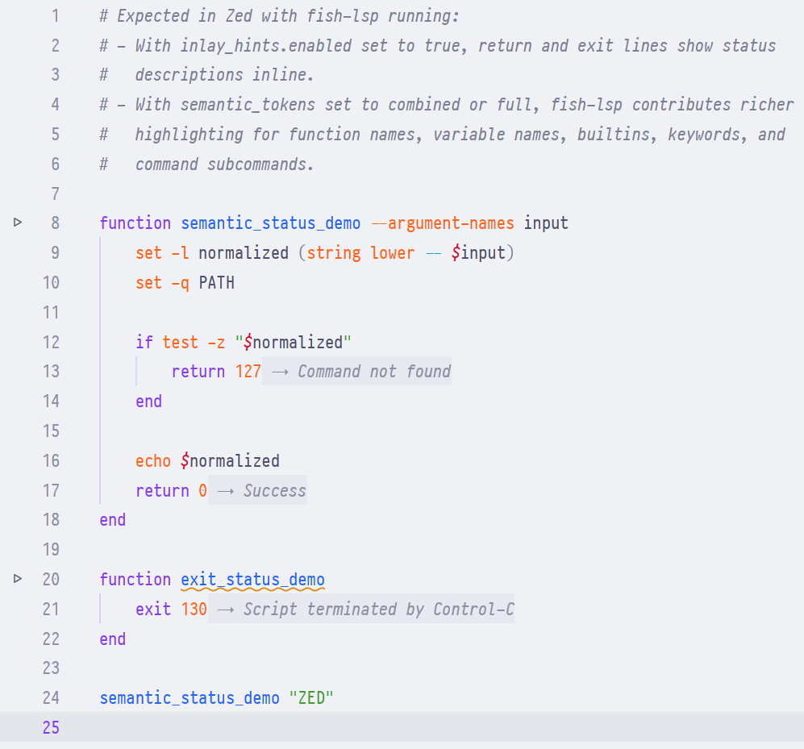

# Fish LSP extension for Zed

[](https://github.com/alysson-souza/zed-fish-lsp/actions/workflows/ci.yml)
[](https://opensource.org/licenses/MIT)

Fish shell support for [Zed](https://zed.dev) using [fish-lsp](https://github.com/ndonfris/fish-lsp). The extension adds code completion, hover documentation, go to definition, diagnostics, and other language server features to Fish scripts.

<p align="center">
  
</p>

## Features

### Syntax highlighting

- Syntax highlighting via tree-sitter
- Keyword bracket matching (`function`/`end`, `if`/`end`, etc.)
- Regex syntax highlighting inside `grep`, `sed`, `rg`, `awk`, `string match -r`

### LSP support

- Code completion
- Hover documentation
- Go to definition
- Find references
- Diagnostics
- Code actions
- Formatting
- Inlay hints, when enabled in Zed settings
- Semantic tokens, when enabled in Zed settings

### Editor integration

- Code outline
- Auto-indentation
- Vim/Helix text objects (`vaf` for function, `vic` for control structure body)
- Screen sharing privacy (strings and variables redacted when sharing)
- Runnables (run scripts and functions with a click)

## Installation

1. Clone this repository
2. Open Zed
3. Open the command palette
4. Run `zed: install dev extension`
5. Select this directory

### LSP binary

The extension first looks for `fish-lsp` in your PATH. If it is not installed, Zed downloads it through its built-in npm support.

To install fish-lsp manually:

```bash
npm install -g fish-lsp
```

## Configuration

The default settings work without configuration. To change fish-lsp behavior, add the options you need to your Zed `settings.json`:

```jsonc
{
  "lsp": {
    "fish-lsp": {
      "initialization_options": {
        // Disable specific diagnostic codes (default: [])
        "fish_lsp_diagnostic_disable_error_codes": [2002, 2003],
        // Max diagnostics per file (default: 0 = unlimited)
        "fish_lsp_max_diagnostics": 100,
        // Extra paths to index for completions and go-to-definition
        // (default: ["$__fish_config_dir", "$__fish_data_dir"])
        "fish_lsp_all_indexed_paths": [
          "$__fish_config_dir",
          "$__fish_data_dir",
          "~/my-fish-scripts",
        ],
        // Paths where rename/refactoring is allowed
        // (default: ["$__fish_config_dir"])
        "fish_lsp_modifiable_paths": [
          "$__fish_config_dir",
          "~/my-fish-scripts",
        ],
        // Disable specific LSP handlers (default: [])
        // Available: complete, hover, rename, definition, implementation, reference, logger,
        // formatting, formatRange, typeFormatting, codeAction, codeLens, folding, selectionRange,
        // signature, executeCommand, inlayHint, highlight, diagnostic, popups, semanticTokens
        "fish_lsp_disabled_handlers": ["formatting"],
        // Log file for debugging (default: "" = disabled)
        "fish_lsp_log_file": "/tmp/fish-lsp.log",
        // Log level, one of error, warning, info, debug, trace (default: "")
        "fish_lsp_log_level": "debug",
        // Set false to index fish_lsp_all_indexed_paths as additional workspaces
        // (default: true)
        "fish_lsp_single_workspace_support": false,
        // Paths ignored during workspace discovery
        // (default: ["**/.git/**", "**/node_modules/**", "**/containerized/**", "**/docker/**"])
        "fish_lsp_ignore_paths": [
          "**/.git/**",
          "**/node_modules/**",
          "**/containerized/**",
          "**/docker/**",
        ],
        // Max depth for workspace discovery (default: 3)
        "fish_lsp_max_workspace_depth": 3,
        // Pin the fish executable used by fish-lsp child processes (default: "fish")
        "fish_lsp_fish_path": "/usr/bin/fish",
      },
    },
  },
}
```

When updating older settings, replace `fish_lsp_logfile` with `fish_lsp_log_file`. The old `fish_lsp_format_exec` and `fish_lsp_format_args` options are not part of the current fish-lsp configuration schema. Formatting is handled by `fish_indent`. Disable formatting with `fish_lsp_disabled_handlers` or use `# @fish_indent: off` and `# @fish_indent: on` comments in Fish files.

See [fish-lsp](https://github.com/ndonfris/fish-lsp) for diagnostic codes and configuration options.

### Runnables

The extension adds run buttons for Fish scripts and functions.

- Click the run button on a script's shebang line, such as `#!/usr/bin/env fish`, to run the script.
- Click the run button on a function name to source the file and run that function.

> Nested functions cannot run on their own because they exist only in the parent function's scope.

To override the default commands, add tasks with matching tags to your project's `.zed/tasks.json` or global `~/.config/zed/tasks.json`:

```json
[
  {
    "label": "Run: $ZED_FILENAME",
    "command": "fish",
    "args": ["$ZED_FILE"],
    "tags": ["fish-script"]
  },
  {
    "label": "Run: $ZED_SYMBOL",
    "command": "source \"$ZED_FILE\"; and $ZED_SYMBOL",
    "shell": { "program": "fish" },
    "tags": ["fish-function"]
  }
]
```

## Development

### Prerequisites

- Rust (via rustup)
- Zed editor

### Building

```bash
cargo check --target wasm32-wasip1
```

### Testing

```bash
cargo test
```

## Credits

- [fish-lsp](https://github.com/ndonfris/fish-lsp), the Fish language server
- [tree-sitter-fish](https://github.com/ram02z/tree-sitter-fish), the tree-sitter grammar
- [hasit/zed-fish](https://github.com/hasit/zed-fish), a reference for tree-sitter queries

## License

This project uses the MIT License. See [LICENSE](LICENSE) for details.
